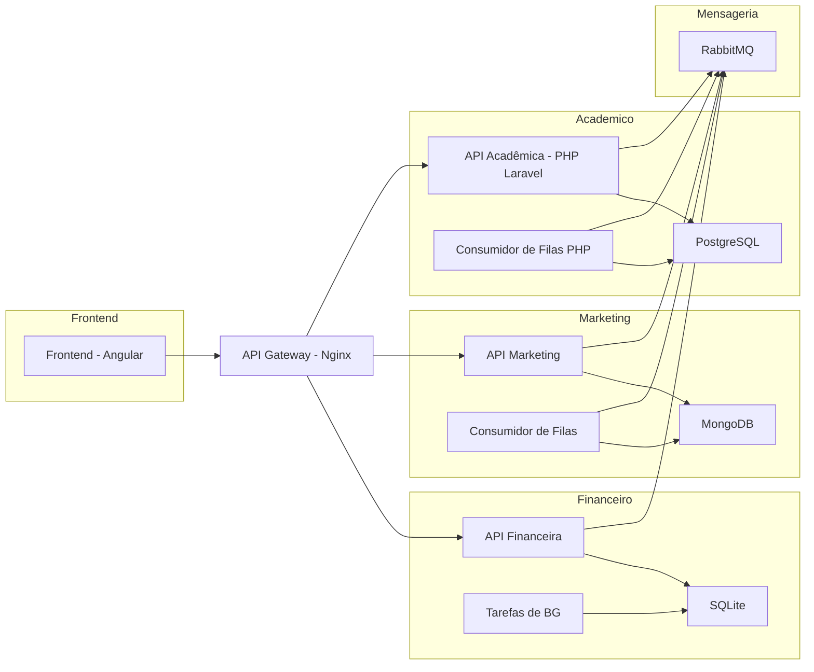

# Overview of Application Architecture

```mermaid

flowchart LR
    subgraph Frontend
        A[Frontend - Angular]
    end

    A --> B[API Gateway - Nginx]

    subgraph Financeiro
        direction TB
        C[API Financeira]
        D[Tarefas de BG]
        E[SQLite]
        C --> E
        D --> E
    end

    subgraph Marketing
        direction TB
        F[API Marketing]
        G[Consumidor de Filas]
        H[MongoDB]
        F --> H
        G --> H
    end

    subgraph Academico
        direction TB
        I[API Acadêmica - PHP Laravel]
        J[Consumidor de Filas PHP]
        K[PostgreSQL]
        I --> K
        J --> K
    end

    B --> C
    B --> F
    B --> I

    subgraph Mensageria
        L[RabbitMQ]
    end

    C --> L
    F --> L
    G --> L
    I --> L
    J --> L

```
